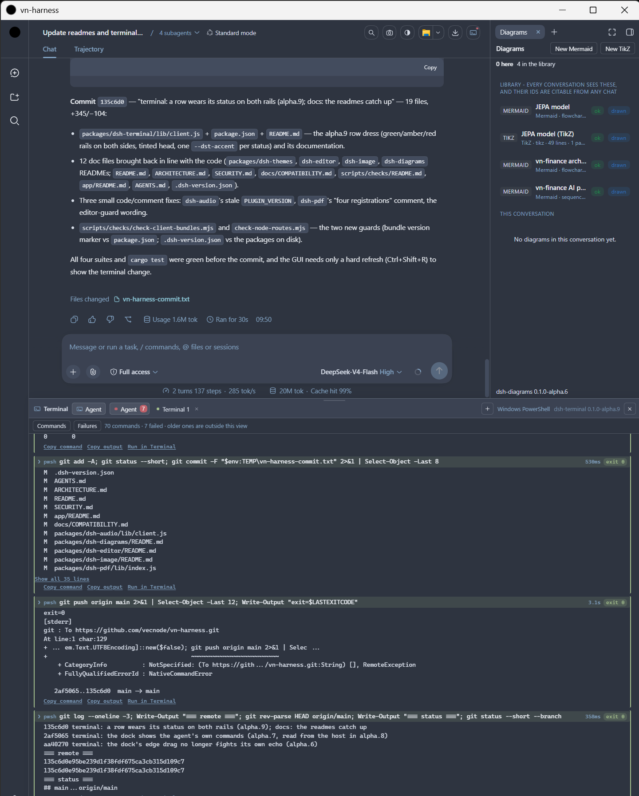
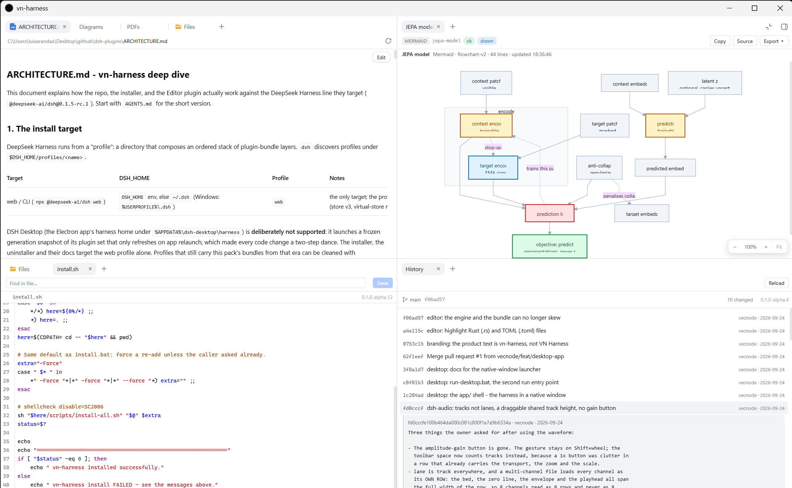

# 🤖 vn-harness

    

Agent Application with core [DSH](https://www.deepseek.com/harness/en/).

A native cross-platform app plus a pack of standard **dsh bundles**. The plugins
are plain JavaScript with **zero npm dependencies**; the launchers run on
**Windows, macOS and Linux** (PowerShell on one side, plain POSIX shell on the
other, and the Unix half never needs PowerShell). Nothing patches a DeepSeek core
file: every plugin registers its own rows, and the two surfaces it replaces - the
right bar, and the file-manager half of *Open In…* - are **forked into this
repository** and declared in a `cordis.patch.yml`.

  
  
   
  <em><code>run-desktop.bat</code>: the splash while <code>npx</code> works, and the same window once the harness is listening.</em>

## Install

A release archive **is** the app - there is no installer and nothing to compile.
Node.js 22 or newer is the only prerequisite; the pinned harness is fetched by
`npx` on the first run. (Windows also wants the WebView2 runtime, which Windows 10
and 11 already have.)

| | Windows | macOS / Linux |
|---|---|---|
| **From a release** | extract the zip, then double-click `START-HERE.bat` | extract, then `./START-HERE.sh` |
| **From a clone** | `install.bat` | `./install.sh` |
| **Remove** | `uninstall.bat` | `./uninstall.sh` |
| **Direct, no script** | `powershell -File scripts/install-all.ps1 -Force` | `sh scripts/install-all.sh -Force` |

`START-HERE` and `install` add every bundle under `packages/` to the harness web
profile (`~/.dsh/profiles/web`), copy the skills a bundle ships into
`~/.dsh/skills`, and print what to do next; re-running either is safe.
`START-HERE` then opens the app, `install.bat` never does, and `vn-harness.exe`
only runs. Bundles are added as **live links** into this folder, so a code edit
applies on restart and the folder is not a copy. `-Plugin`, `-DshHome`,
`-ProfileName`, `-DshVersion` and `-Force` are in [docs/INSTALL.md](docs/INSTALL.md).

## Run

| | Windows | macOS / Linux |
|---|---|---|
| **Native window** | `run-desktop.bat` | `cargo build --release` in `app/src-tauri` |
| **Browser tab** | `run-web.bat` | `./run-web.sh` |

Both start `npx @deepseek-ai/dsh@<pin> web` and open the URL it prints: the native
window loads it in a WebView2 / WKWebView / WebKitGTK window, the other in Chrome,
falling back to your default browser. The URL is opened only when it names a
**loopback** address, and the launch token is never written to a file - both rules
are in [SECURITY.md](SECURITY.md).

Flags: `-Port <n>` when 3080 is taken, `-NoBrowser` to start the server alone,
`-DefaultBrowser` to skip Chrome, `-Help` anywhere.

The desktop shell answers the two questions worth asking while it starts: whether
a **DeepSeek key** was found and which layer supplied it (the environment,
`$DSH_HOME/.credentials.yaml`, or a `.env`), and which **harness home** this run
will use. That is why installing a newer release over an older one is a non-event:
sessions, settings and the key live in `~/.dsh`, not in the folder you replaced.
The key's value never leaves the shell. Details: [app/README.md](app/README.md).

## Plugins (all **alpha**)

Every package's own README is the reference for what it does, why it is built that
way and what it touches. The exact versions are in
[`.dsh-version.json`](.dsh-version.json).

| Package | What it adds |
|---|---|
| [`dsh-vn-master`](packages/dsh-vn-master/README.md) | the blank master, installed **last** - the slot pack-wide patches go in |
| [`dsh-rightbar`](packages/dsh-rightbar/README.md) | the pack's own right bar: tab strip, docking panel and the `sidebarRight` registry (a fork of the shipped bar) |
| [`dsh-rightbar-files`](packages/dsh-rightbar-files/README.md) | the Files tab type on top of that bar |
| [`dsh-editor`](packages/dsh-editor/README.md) | text and code tabs (vendored CodeMirror 6), with a Markdown preview and Save/Create |
| [`dsh-gittree`](packages/dsh-gittree/README.md) | **read-only** History tab: the workspace's commits, and the files each one touched |
| [`dsh-image`](packages/dsh-image/README.md) | an image viewer that fits, zooms, pans, and reads the source pixel under the pointer |
| [`dsh-audio`](packages/dsh-audio/README.md) | a waveform surface: WAV/AIFF/FLAC, one track per channel, dBFS, selection and playback |
| [`dsh-diagrams`](packages/dsh-diagrams/README.md) | Mermaid and TikZ as tabs *and* six agent tools, every write validated before it is stored |
| [`dsh-pdf`](packages/dsh-pdf/README.md) | PDF as a surface the agent can read and **scan**, plus a reader tab with thumbnails and bookmarks |
| [`dsh-terminal`](packages/dsh-terminal/README.md) | a real shell in a bottom dock (vendored xterm.js over the harness's own `node-pty`) |
| [`dsh-themes`](packages/dsh-themes/README.md) | header controls (themes incl. Nord/Monokai/Hacker, screenshot, page zoom), the Markdown paper, VN branding |
| [`dsh-ui-state`](packages/dsh-ui-state/README.md) | the pack's own UI state (zoom, theme, dock, column widths) remembered host-side |
| [`dsh-modal`](packages/dsh-modal/README.md) | the shared dialog surface (`modals`) the pack's controls use |
| [`dsh-open-in-app`](packages/dsh-open-in-app/README.md) | *Open In…* patched to open the OS file browser directly |

The pack used to ship its own Files panel (`dsh-files`, earlier `dsh-focus`); that
was retired when the harness grew a real right Sidebar, and the installer prunes
the old names so an upgrade cannot double-mount.

## Security & license

- MIT - see [LICENSE](LICENSE). Plugins are authored by **vecnode**.
- [SECURITY.md](SECURITY.md): the threat model, the launch token, what the pack
  deliberately does not do, and how `check-no-secrets.mjs` keeps a credential out
  of a commit. Report a vulnerability privately, as described there.
- [ARCHITECTURE.md](ARCHITECTURE.md) is the deep dive; [docs/](docs) holds install,
  distribute, compatibility and per-host notes.
