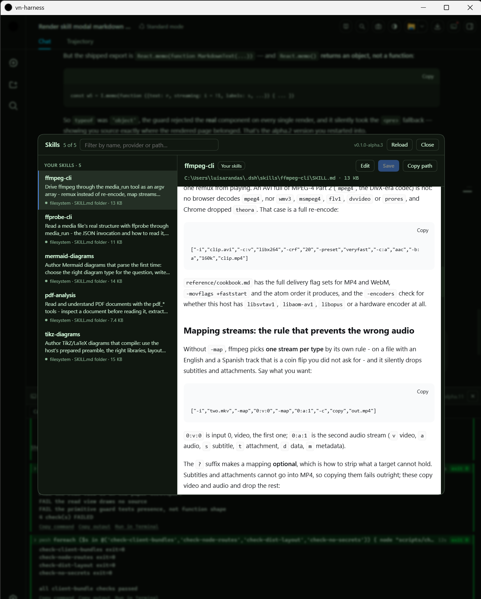

# 🤖 vncode

    

Agent IDE with core [DSH](https://www.deepseek.com/harness/en/).

A native cross-platform app plus a pack of standard **dsh bundles**. The plugins
are plain JavaScript with **zero npm dependencies**; the launchers run on
**Windows, macOS and Linux** (PowerShell on one side, plain POSIX shell on the
other, and the Unix half never needs PowerShell).

  

## Run

| | Windows | macOS / Linux |
|---|---|---|
| **Native window** | `scripts\run-desktop.bat` | `cargo build --release` in `app/src-tauri` |
| **Browser tab** | `scripts\run-web.bat` | `./scripts/run-web.sh` |

Both start the pinned harness and open the URL it prints: the native window loads
it in a WebView2 / WKWebView / WebKitGTK window, the other in Chrome, falling back
to your default browser. The URL is opened only when it names a **loopback**
address, and the launch token is never written to a file - both rules are in
[SECURITY.md](SECURITY.md).

**How the harness is started depends on whether the runtime is vendored.** When
`runtime/<rid>/` exists - produced once by `scripts\dsh\vendor.ps1` - the shell
launches `node <runtime>/harness/…/lib/bin.js web --no-open` **directly**, with no
npm, no npx, no registry and no cache of any kind involved. Nothing is fetched to
start the app, and the network is used only for the chat and search themselves.
Without a vendored runtime the launcher falls back to
`npx @deepseek-ai/dsh@<pin> web`, which is the source-checkout path.

Flags: `-Port <n>` when 3080 is taken, `-NoBrowser` to start the server alone,
`-DefaultBrowser` to skip Chrome, `-Help` anywhere.

The desktop shell answers the two questions worth asking while it starts: whether
a **DeepSeek key** was found and which layer supplied it (the environment,
`$DSH_HOME/.credentials.yaml`, or a `.env`), and which **harness home** this run
will use. That is why installing a newer release over an older one is a non-event:
sessions, settings and the key live in `~/.dsh`, not in the folder you replaced.
The key's value never leaves the shell. Details: [app/README.md](app/README.md).

## Plugins

Every package's own README is the reference for what it does, why it is built that
way and what it touches. The exact versions are in
[`.dsh-version.json`](.dsh-version.json).

| Package | What it adds |
|---|---|
| [`dsh-vn-master`](packages/dsh-vn-master/README.md) | the browser-free master, installed **last** - the slot pack-wide patches and row restatements go in (it enables the Browser tab on the web profile, and removes the feedback surface) |
| [`dsh-rightbar`](packages/dsh-rightbar/README.md) | the pack's own right bar: tab strip, docking panel and the `sidebarRight` registry (a fork of the shipped bar) |
| [`dsh-rightbar-files`](packages/dsh-rightbar-files/README.md) | the Files tab type on top of that bar |
| [`dsh-editor`](packages/dsh-editor/README.md) | text and code tabs (vendored CodeMirror 6), with a Markdown preview and Save/Create |
| [`dsh-gittree`](packages/dsh-gittree/README.md) | **read-only** History tab: the workspace's commits as a graph rail (lanes, merges, PR chips), and the files each one touched |
| [`dsh-image`](packages/dsh-image/README.md) | an image viewer that fits, zooms, pans, and reads the source pixel under the pointer |
| [`dsh-audio`](packages/dsh-audio/README.md) | a waveform surface: WAV/AIFF/FLAC, one track per channel, dBFS, selection and playback |
| [`dsh-media`](packages/dsh-media/README.md) | media the agent can work with: `media_probe` / `media_run` / `media_frames` over a **pinned, SHA-256-verified** ffmpeg copy, plus the routes the video tab streams through |
| [`dsh-video`](packages/dsh-video/README.md) | a player tab that streams and seeks any video container, with an ffprobe facts panel, chapter jumps and a one-click remux when the browser cannot decode it |
| [`dsh-diagrams`](packages/dsh-diagrams/README.md) | Mermaid and TikZ as tabs *and* six agent tools, every write validated before it is stored |
| [`dsh-pdf`](packages/dsh-pdf/README.md) | PDF as a surface the agent can read and **scan**, plus a reader tab with thumbnails and bookmarks |
| [`dsh-browser`](packages/dsh-browser/README.md) | the **Browser** tab, replacing the shipped iframe one: the page is rendered on the host in a disposable engine behind an https-only egress gate (screenshot, post-script text, measured styles) for the tab and for `browser_render` / `browser_query` / `browser_text` — **built and shipped, but turned OFF**: the master layer disables the row, so a profile loads no tab, no routes, no tools and no client bundle |
| [`dsh-skills`](packages/dsh-skills/README.md) | the **Skills browser**: a header button left of the zoom control opens every skill this conversation loads, with its markdown and inline editing |
| [`dsh-cmdbar`](packages/dsh-cmdbar/README.md) | the **command bar**: the agent's own commands in a bottom dock (a read-only transcript of the conversation's log — the terminals were removed in alpha.12; the panel follows whichever conversation is on screen) |
| [`dsh-themes`](packages/dsh-themes/README.md) | header controls (themes incl. Nord/Monokai/Hacker, screenshot, page zoom), the Markdown paper, VN branding, and the shipped account-menu Feedback row hidden |
| [`dsh-ui-state`](packages/dsh-ui-state/README.md) | the pack's own UI state (zoom, theme, dock, column widths) remembered host-side |
| [`dsh-modal`](packages/dsh-modal/README.md) | the shared dialog surface (`modals`) the pack's controls use |
| [`dsh-open-in-app`](packages/dsh-open-in-app/README.md) | *Open In…* patched to open the OS file browser directly |

The pack used to ship its own Files panel (`dsh-files`, earlier `dsh-focus`); that
was retired when the harness grew a real right Sidebar, and the installer prunes
the old names so an upgrade cannot double-mount.

## Security & license

- MIT - see [LICENSE](LICENSE). Plugins are authored by **vecnode**.
- [SECURITY.md](SECURITY.md): the threat model, the launch token, what the pack
  deliberately does not do, and how `check-no-secrets.mjs` keeps a credential out
  of a commit. Report a vulnerability privately, as described there.
- [ARCHITECTURE.md](ARCHITECTURE.md) is the deep dive; [docs/](docs) holds install,
  distribute, compatibility and per-host notes.
